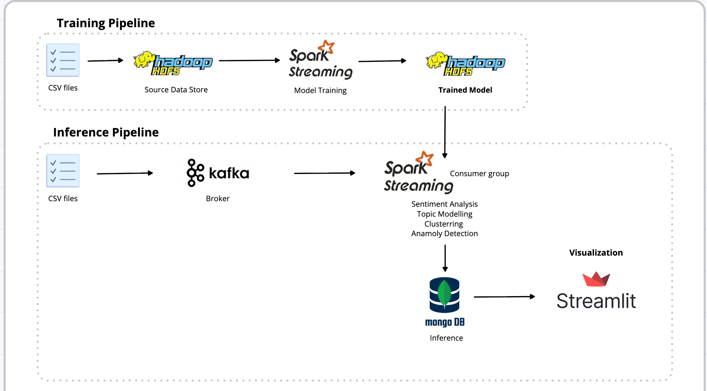

# Trend-Analytics-at-Scale

A distributed streaming analytics platform for processing Flipkart product reviews at scale. Built with Apache Spark, Kafka, and MongoDB to provide real-time sentiment analysis, topic modeling, and customer clustering insights. Built for processing high-volume review streams with scaling capability and real-time insights generation.

# System Architecture

# Contributors 

- **Kashinath Alias Kapil Subhash Naik** kashinathn@iisc.ac.in
- **Sujith Shetty** sujith1@iisc.ac.in
- **Atreyee Mondal** atreyeem@iisc.ac.in
- **Pranav N** pranavn@iisc.ac.in